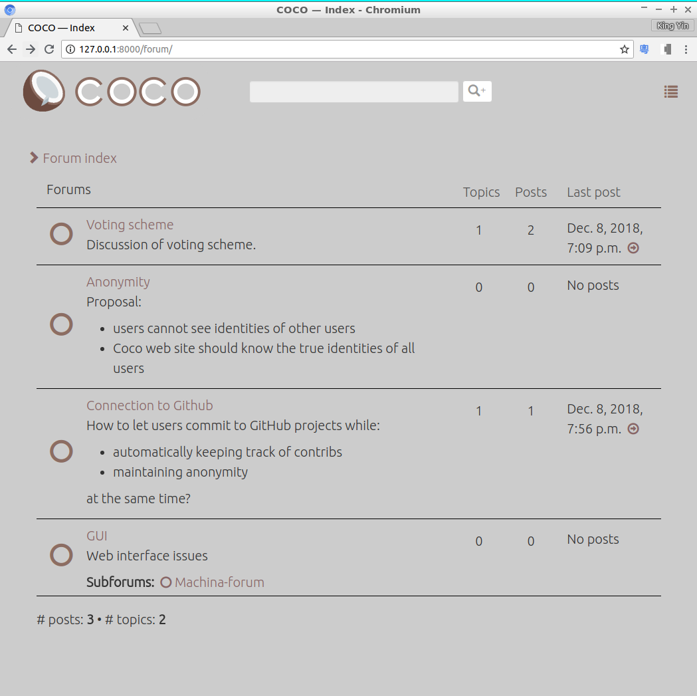

# Coco &mdash; decentralized, autonomous, open-source, for-profit, collaborative platform based on virtual shares

The name Coco comes from "co-operative co-evolution", a kind of evolutionary algorithm.

* A company's **stock prices** are determined externally by the free-market ("invisible hand")

* How the company distributes its **shares** are decided internally;  This is where COCO tries to innovate.

Features
--------

The following features are tentative and subject to change:

* **Autonomy** &mdash; No boss, no management, no strict hierarchy.  Teams / clusters are formed according to needs.

* **Anonymity** &mdash; Currently COCO allows projects to choose their own policies:
  * _real-name_
  * _anonymous_
  * _mixed_

  In **anonymous** mode, members can only see contributions but not the identities of their originators.  Contributions are valued purely on their _intrinsic merits_.

  In **real-name** mode, the real-world _reputation_ of a contributor may help others to trust or distruct them.

* Contributors get **shares** instead of one-time income.  Projects can sustain for a long time as old members leave and new members join.

* Shares are assigned via 2 possible schemes:

  * **Voting** &mdash; the rating scheme is **weighted**, ie, members with low contribution have low weights, so that _malicious attacks_ would not affect the ratings.

  * **Bidding** &mdash; the first founder owns 100% of shares; late-comers bid for shares with new contributions.

* **License** &mdash; _Free_ open-source software _sucks_ because contributors don't get paid and they have to rely on grotesque, indirect means of income.  Recently there is a new **for-profit open-source** license called [License Zero](https://licensezero.com/) with additional terms stipulating that anyone who runs or deploys the software must pay for it according to separate license conditions.  Using of this license combined with our platform, makes the money-making process completely _automatic_.

* An interface to **GitHub** could be built so that all members commit to GitHub projects anonymously via COCO.

* This platform could be developed by an anonymous team using this platform **itself**, sort of "recursively".

White paper (draft, contains tentative ideas):  
[&mdash; Chinese version](COCO-white-paper-cn.pdf)  
[&mdash; English version](COCO-white-paper-en.pdf)  

Similar Projects
----------------
We are considering collaboration with [Colony.io](https://colony.io/) which is based on Ethereum.  They seem to focus on providing the block-chain infra-structure whereas COCO is more concerned with the user-interface for online companies.

To-do
-----
* shares and rating system
* interface to GitHub
* ....

Completed
---------
* 5-Dec-2018 : user login / auth / register
* 8-Dec-2018 : anonymous forum

Discussion forum
----------------

Please visit this [temporary discussion forum](http://cybernetic1.pythonanywhere.com/) and leave some comments there. (Just create a new user account)

Screeh shot:

Try out this (very simple) GUI here:  
https://cybernetic1.github.io/  
which shows how peers can rate each other with scores that always sum to 100%.
